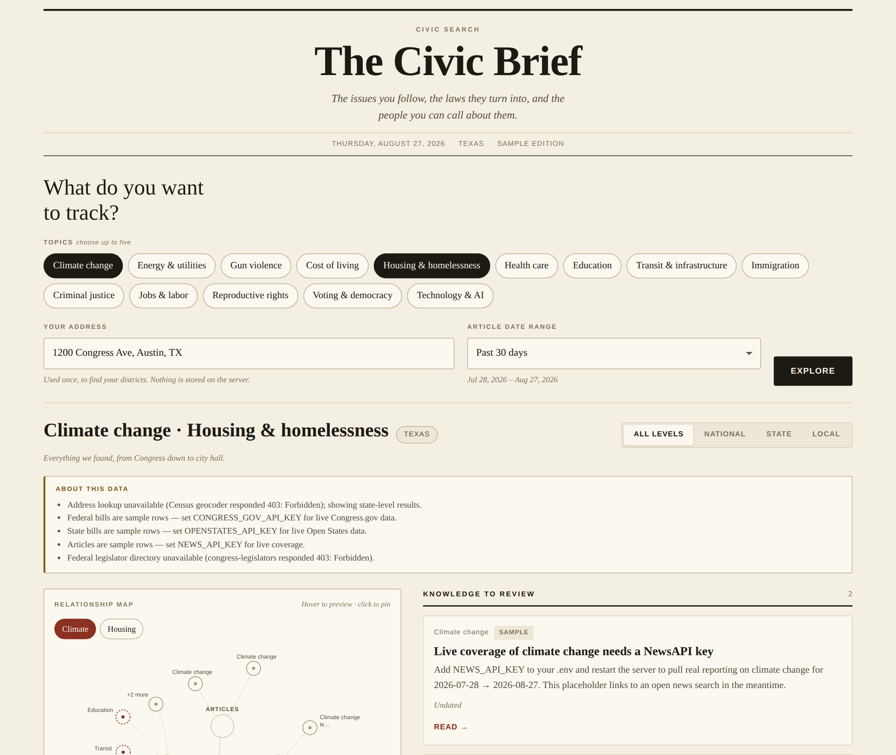

# The Civic Brief — `civic-search`

Pick the issues you care about, drop in your address, and get back one page: the
reporting to read, the bills moving right now at every level of government, the
laws already on the books, the people you can actually call — and how the issues
you picked connect to the ones you didn't.

Everything is drawn as a single relationship map next to the columns it
describes. Hover a node to preview a card, click it to pin.

Newsprint on parchment: serif type, hairline rules, no chrome.



---

## Quick start

```bash
npm install
cp .env.example .env      # optional — the app runs without keys
npm start                 # http://localhost:3000
```

With no keys at all the app is fully navigable: every column renders, and rows
that would have come from a live provider are labelled **Sample**. Add keys one
at a time and each column swaps over to live data on the next request.

```bash
npm run dev               # same, with --watch
```

Requires Node 20.6+ (it uses `--env-file-if-exists` and built-in `fetch`).

## API keys

| Variable | Powers | Where to get it | Cost |
| --- | --- | --- | --- |
| `NEWS_API_KEY` | Articles, filtered by your date range | [newsapi.org/register](https://newsapi.org/register) | Free developer tier |
| `CONGRESS_GOV_API_KEY` | Federal bills and enacted laws | [api.data.gov/signup](https://api.data.gov/signup) | Free |
| `OPENSTATES_API_KEY` | State bills and your state legislators | [Plural / Open States](https://open.pluralpolicy.com/accounts/profile/) | Free tier |

Two more sources need no key and are always live: the **Census geocoder**
(address → congressional and state legislative districts) and the
**@unitedstates congress-legislators** dataset (every sitting member of
Congress, with phone, office, contact form, and photo).

Check them all at once:

```bash
npm run check                                   # uses a default address + topic
npm run check -- "350 5th Ave, New York, NY" housing
```

It prints a pass/fail line per provider with the first record it parsed, so a
wrong key, a blocked host, or a changed upstream field is obvious before you go
hunting through the UI.

Keys are read once at boot from the environment. They are never sent to the
browser — the front end only ever talks to this server, and `/api/topics`
reports which providers are live so the page can say so honestly.

### Running in a sandboxed environment

If you run this somewhere with an egress allowlist (Claude Code on the web, CI,
a locked-down container), these hosts need to be reachable or every column falls
back to sample rows:

```
newsapi.org                 api.congress.gov         v3.openstates.org
geocoding.geo.census.gov    unitedstates.github.io   theunitedstates.io
```

The last one serves member photos and is fetched by the browser, not the server.

## What the reader gets

- **Topics** — 14 issues, multi-select up to five. Selecting more than one gives
  you a focus switcher above the map.
- **Address** — geocoded once per request, never stored. It resolves your state,
  county, place, congressional district, and both state legislative districts.
- **Date range** — presets (week / 30 days / 3 months / year) or a custom
  from–to pair. It filters articles, and narrows state bill activity.
- **Level tabs** — All / National / State / Local filter the bills, laws, and
  people together with the map.
- **Connected issues** — every related topic card explains *why* the two issues
  touch, and can be added to the brief in one click.

The query lives in the URL, so any brief is a shareable link.

## How it fits together

```
public/                     no build step, no framework
  index.html                one page
  styles.css                design tokens + layout
  js/api.js                 fetch wrappers
  js/graph.js               graph model + SVG renderer with a highlight controller
  js/app.js                 state, form, feed, wiring
server/
  index.js                  express app + static hosting
  config.js  cache.js       env config, in-memory TTL cache
  http.js                   JSON fetch with timeouts and provider-tagged errors
  data/topics.js            the taxonomy and the connection edge list
  data/states.js            state lookup + fallback state detection
  services/news.js          NewsAPI
  services/geo.js           Census geocoder
  services/officials.js     congress-legislators + Open States people
  services/legislation.js   Congress.gov + Open States bills
  routes/brief.js           GET /api/topics, GET /api/brief
```

### Endpoints

```
GET /api/topics
GET /api/brief?topics=climate,housing&address=1200+Congress+Ave,+Austin,+TX
                &from=2026-07-28&to=2026-08-27
GET /api/health
```

`/api/brief` fans out to every provider in parallel and always returns 200 with
whatever it got. A dead or unconfigured upstream degrades exactly one column and
adds a line to `notices[]`, which the page renders in the "About this data" box.
Responses are cached in memory for `CACHE_TTL_SECONDS` (default 15 minutes).

### The graph

`buildGraph()` turns a brief into three rings — your focused issue at the
centre, one node per category, then the individual items as leaves — laid out in
a fixed 760×640 viewBox. Labels are HTML positioned in percentages over the SVG,
anchored radially outward so no edge ever crosses its own node's text.
`renderGraph()` draws once and returns a controller; hovering only repaints
attributes, so keyboard focus survives interaction. Nodes are real buttons:
tab to one, press Enter, and the matching card pins and scrolls into view.

## Known limits

- **Local government.** There is no free nationwide API for city councils,
  mayors, or school boards — Google's Civic Information *representatives*
  endpoint was retired in 2025 — so the Local tab links out to your place's own
  directory instead of inventing an officeholder. Wire in a municipal source
  (Legistar, Granicus, your city's open-data portal) to fill it.
- **Federal bill search.** The Congress.gov API has no keyword search, so the
  federal column scans the most recently updated bills of the current Congress
  and matches them against each topic's vocabulary. It favours legislation that
  is actually moving; it is not an exhaustive search.
- **NewsAPI lookback.** Developer keys only serve about the last 30 days. Longer
  ranges are clamped for articles and the page says so.
- **Sample rows** are placeholders, not reporting. They carry no invented bill
  numbers, sponsors, or officeholders.

## Licence

MIT.
